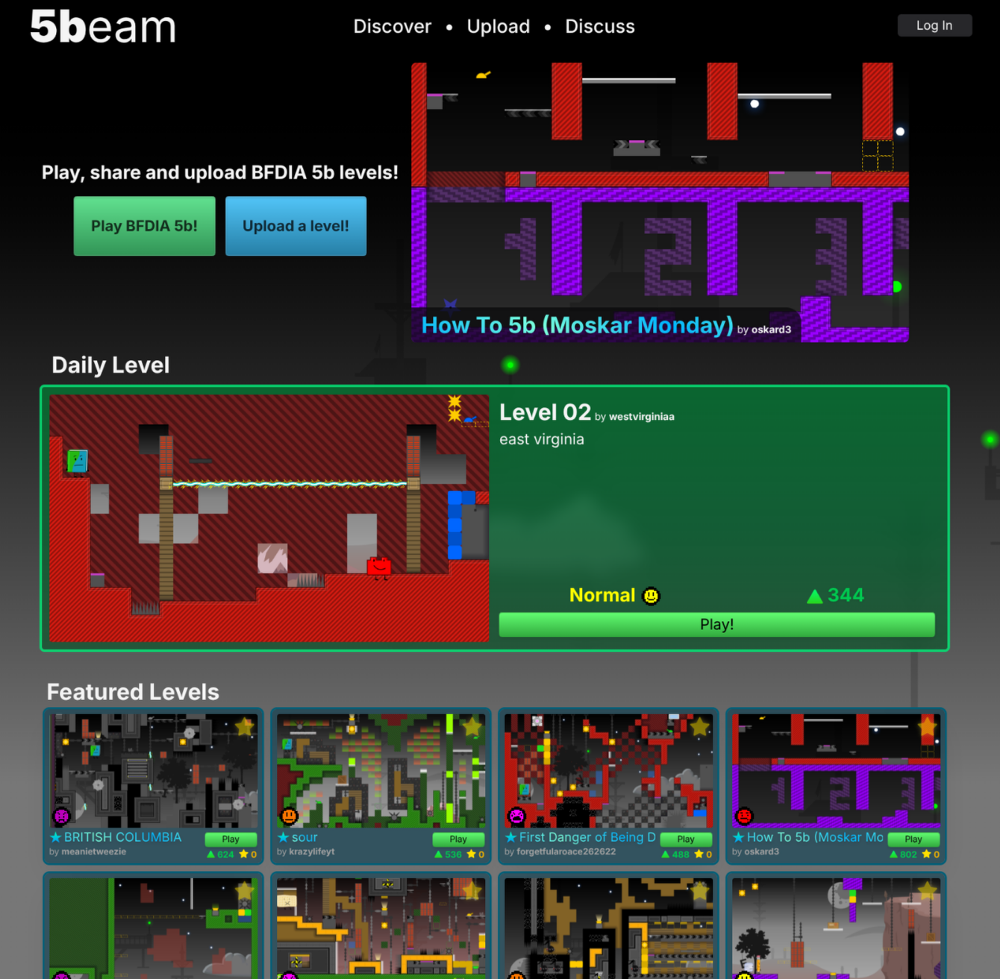

# 

**[5beam](https://5beam.zelo.dev)** (5b Explore API Machine) lets you upload, play and share custom levels for the web game [BFDIA 5b](https://coppersalts.github.io/HTML5b/). With over 15,000 levels and over a thousand users, 5beam is the largest level sharing platform for BFDIA 5b! You can also...

 Play daily levels

  Create levelpacks, which are collections of levels

 Star favourite levels & levelpacks

## Tech Stack

- **Netlify** for edge hosting, prerendering and automated functions (daily levels!)
- **SvelteKit** as fullstack framework
- **AWS Lambda** for level thumbnail generation
- **Umami** for analytics
- **PocketBase** as database

## Contribute

5beam is being actively developed by me, so if you have any suggestions, security concerns or find any bugs, feel free to open an issue or tell me in the [5beam discord](https://discord.gg/um5KWabefm). Issues regarding accessibility are especially welcome!

