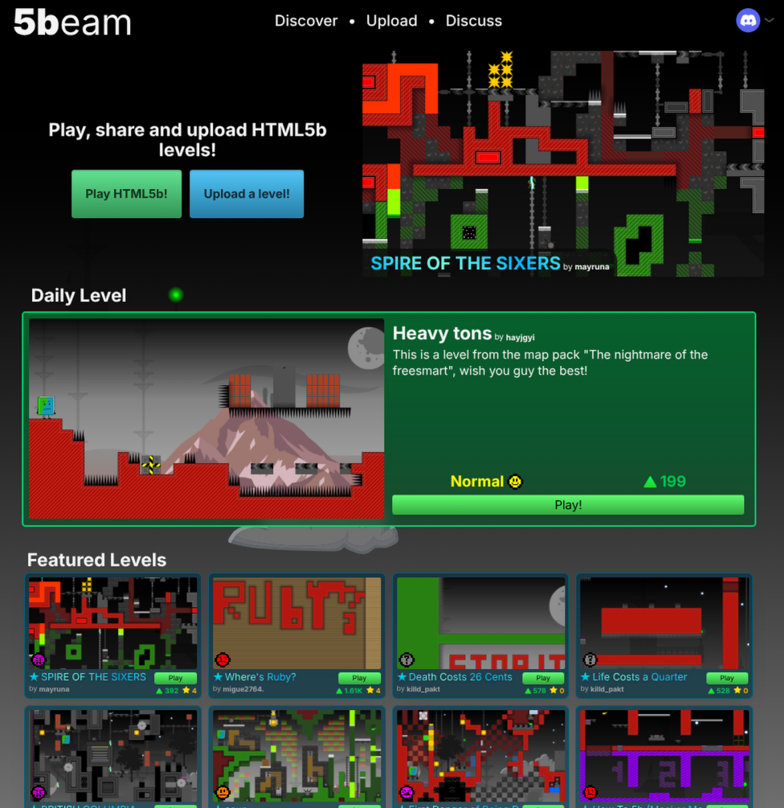

# 

**[5beam](https://5beam.zelo.dev)** (5b Explore API Machine) lets you upload, play and share custom levels for the web port of the flash game "BFDIA 5b" called [HTML5b](https://coppersalts.github.io/HTML5b/). With over 15,000 levels and over a thousand users, 5beam is a level sharing platform for HTML5b! You can also...

 Play daily levels

 Create levelpacks, which are collections of levels

 Star favourite levels & levelpacks

## Tech Stack

- **Netlify** for edge hosting, prerendering and automated functions (daily levels!)
- **SvelteKit** as fullstack framework
- **AWS Lambda** for level thumbnail generation
- **Umami** for analytics
- **PocketBase** as database

## Contribute

If you have any suggestions, security concerns or find any bugs, feel free to open an issue or tell me in the [5beam discord](https://discord.gg/um5KWabefm). Issues regarding accessibility are especially welcome!

